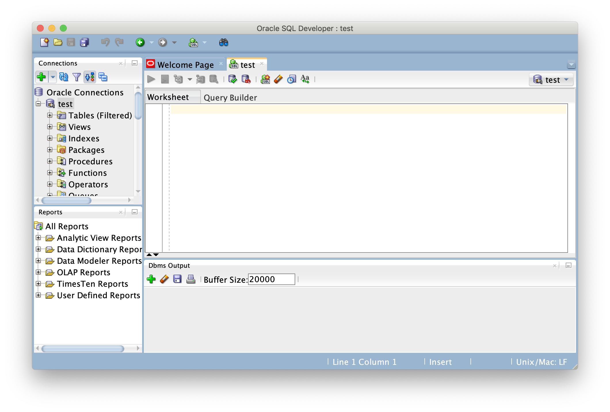

## How to install Oracle Database on Mac by using Docker

[Here](https://github.com/oracle/docker-images/blob/master/OracleDatabase/SingleInstance/README.md) is the official document on Github.


1. Download and install Docker from [here](https://www.docker.com/get-started)
2. Download an image(binary) of Oracle Database for Docker from [here](https://www.oracle.com/database/technologies/oracle-database-software-downloads.html)
I downloaded `Oracle Database 12c Release 1 (12.1.0.2.0) - Enterprise Edition > Linux x86-64`. You don't have to unzip the file you download because the build script we will download will take care of it.
3. Download build script for Docker from Github. (I recommend CUI way.)
 - If you are familiar with CUI(Character User Interface) you can do something like this:
 ```
$ mkdir ~/GitRepository
$ cd ~/GitRepository
$ git clone https://github.com/oracle/docker-images.git
```
 - If you want to use GUI(Graphical User Interface) you can follow a step below:
 1. Create some directory.
 2. Access to an [official source](https://github.com/oracle/docker-images) for Docker configurations, images, and examples of Dockerfiles for Oracle products and projects.
 3. Download a zip file and unzip it.
 


4. Copy the binary you download on step2 to the location of build scrip.  
```
$ cp ~/Downloads/linuxx64_12201_database.zip \
 ~/GitRepository/docker-images/OracleDatabase/SingleInstance/dockerfiles/12.2.0.1
```
5. Run the build script. (`buildDockerImage.sh`)
```
$ cd ~/GitRepository/docker-images/OracleDatabase/SingleInstance/dockerfiles
$ ./buildDockerImage.sh -v 12.2.0.1 -e -i
```
It has a few options:
```
-v: Name of directory (Version of the Database)
-e: Enterprise Edition
-i: ignores the MD5 checksums
```
It takes about 10 minutes.

6. Check if you are able to install the docker image successfully.
```
$ docker images
REPOSITORY          TAG                 IMAGE ID            CREATED             SIZE
oracle/database     12.2.0.1-ee         45defa0b826c        29 hours ago        5.97GB
oraclelinux         7-slim              b19454a5f17a        6 weeks ago         117MB
```
You should see `oracle/database` and `oraclelinux`.

7. Run Docker container
This is the easiest template. You can see more option [here](https://github.com/oracle/docker-images/blob/master/OracleDatabase/SingleInstance/README.md).

```
$ docker run --name docker_oracle \
-p 1521:1521 -p 5500:5500 \
-v /Users/[YOUR_USERNAME]/DockerMountPositon:/opt/oracle/oradata \
oracle/database:12.2.0.1-ee
```

NOTE: You will see a long message like below. You have to take a note of the password.
```
ORACLE PASSWORD FOR SYS, SYSTEM AND PDBADMIN: AZ91SsT3SnI=1

LSNRCTL for Linux: Version 12.2.0.1.0 - Production on 25-DEC-2018 14:37:10

Copyright (c) 1991, 2016, Oracle.  All rights reserved.
...
...
...
#########################
DATABASE IS READY TO USE!
#########################
The following output is now a tail of the alert.log:
Completed: alter pluggable database ORCLPDB1 open
2018-12-25T14:42:46.815487+00:00
ORCLPDB1(3):CREATE SMALLFILE TABLESPACE "USERS" LOGGING  DATAFILE  '/opt/oracle/oradata/ORCLCDB/ORCLPDB1/users01.dbf' SIZE 5M REUSE AUTOEXTEND ON NEXT  1280K MAXSIZE UNLIMITED  EXTENT MANAGEMENT LOCAL  SEGMENT SPACE MANAGEMENT  AUTO
ORCLPDB1(3):Completed: CREATE SMALLFILE TABLESPACE "USERS" LOGGING  DATAFILE  '/opt/oracle/oradata/ORCLCDB/ORCLPDB1/users01.dbf' SIZE 5M REUSE AUTOEXTEND ON NEXT  1280K MAXSIZE UNLIMITED  EXTENT MANAGEMENT LOCAL  SEGMENT SPACE MANAGEMENT  AUTO
ORCLPDB1(3):ALTER DATABASE DEFAULT TABLESPACE "USERS"
ORCLPDB1(3):Completed: ALTER DATABASE DEFAULT TABLESPACE "USERS"
2018-12-25T14:42:48.053830+00:00
ALTER SYSTEM SET control_files='/opt/oracle/oradata/ORCLCDB/control01.ctl' SCOPE=SPFILE;
   ALTER PLUGGABLE DATABASE ORCLPDB1 SAVE STATE
Completed:    ALTER PLUGGABLE DATABASE ORCLPDB1 SAVE STATE
```
It takes about 10 minutes.

8. Check if the container is running.
```
$ docker ps -l --no-trunc
CONTAINER ID
    3299af1792259b6b6f27f2f424d54aa35423fdca0513fdd15b17ac145f0dac92
IMAGE
    oracle/database:12.2.0.1-ee
COMMAND
    "/bin/sh -c 'exec $ORACLE_BASE/$RUN_FILE'"
CREATED
    37 hours ago
STATUS
    Up 13 hours (healthy)
PORTS
    0.0.0.0:1521->1521/tcp, 0.0.0.0:5500->5500/tcp
NAMES
    docker_oracle
```

9. Download SQL Developer from [here](https://www.oracle.com/tools/downloads/sqldev-v192-downloads.html)


10. Launch the SQL Developer and click the green plus button on left.


11. Setup connection setting.

